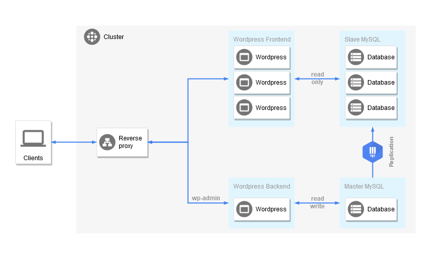

# Scalable Wordpress / Mysql 

Wordpress and Mysql high availability on Kubernetes.

## Installation

Change the domain url in `k8s/ingress.yml`.

Change variables in `k8s/database.env` by yours and build with kustomize :
```sh
kustomize build k8s > k8s.yml
``` 

Then create a namespace and deploy :
```sh
kubectl create ns wordpress-ha
kubectl -n wordpress-ha apply -f k8s.yml
```

## Architecture



There is 2 statefulset for MySql :
* First is Master, which has one replica
* Second is Slave, which has N replica

There is 2 deployment for Wordpress :
* A backend, which has one replica (or more but it's probably useless), and is connect to MySql master to read / write data. 
* A frontend, which has N replica, and is connect to MySql slave to read data (it can't write).

If URL begins by /wp-admin or /wp-login the reverse proxy redirect to wordpress backend, else it redirect to frontend.

## Increase pods number
```sh
# Increase number of database
kubectl scale -n wordpress-ha --replicas=3 statefulset/database-slave

# Increase number of wordpress
kubectl scale -n wordpress-ha --replicas=3 deployment/wordpress-frontend
```

## References

Mysql replication inspired by Kublr [article](https://kublr.com/blog/setting-up-mysql-replication-clusters-in-kubernetes-2/).
